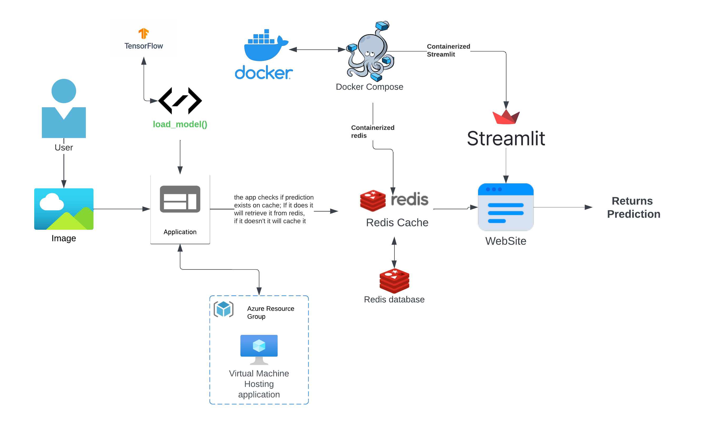
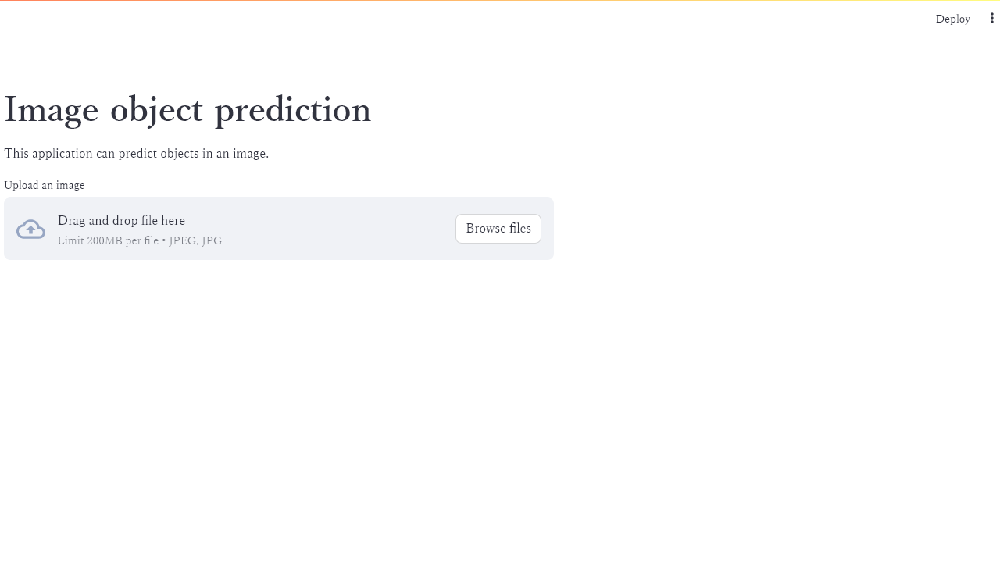
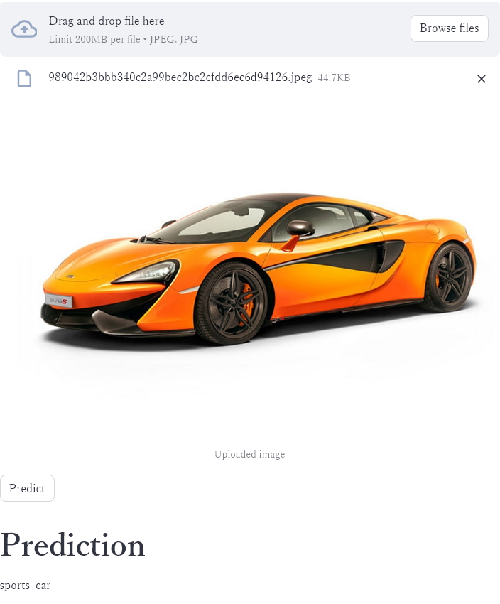

# Streamlit-Mlops-Image-Classification

Here, the application is able to identify objects in any image. It utilizes the `ResNet50` pretrained model.

We are using Streamlit for frontend and Redis on the backend to significantly improve performance.

## Architecture

The app is containerized. We will use docker compose to deploy two containers, one for the Streamlit and the other
for the Redis.

The Dockerfile used to build the image can be found in this repository.

Redis was built using `redis:latest` image.



We will deploy the app on the cloud on an Azure VM.
> Make sure you have port 8501 outbound open

Just run `docker-compose up -d` to start.
> you can use `docker-compose down` to stop.

You can clone the repository into the machine or simple create the `docker-compose.yml` file into the VM.

The app can them be accessed through the machine's IP address followed by the port: `0.0.0.0:8501` where `0.0.0.0` is
the machine ip. For example: `127.0.0.1:8501`
> it may take a while for the app to start

### Important points:

`redis.conf` was used to change some settings:

- first, `bind 0.0.0.0` so that redis can take the container's ip address;
- second, `protected-mode yes` so that no one can access redis's database and keep the data secured.

On docker-compose file, we specify port 6379 for redis and 8501 for streamlit.

The app can them "talk" with redis and cache data.

The app can be accessed with the machine's ip.

### Tools used:

- Redis
- Azure Web App
- GitHub Actions
- Docker (?)
- Azure ML Pipelines
- Terraform
- Streamlit
- TensorFlow

## How it works

The user uploads any image to the application, then, the app returns a human-readable prediction of the image.

It's a simple Python app that uses a pretrained model to predict on the image.

With streamlit, a simple interface will be available to upload and check the prediction on the image:



And them, the user can click `predict` to get a human-readable prediction on the image:



Once an image is uploaded, the app will check if the image is cached, if not it will be cached on Redis;
If the same image is uploaded again, the prediction will be
much faster since the app will get the prediction from Redis.


### Notes

- We are using ```st.cache_resource``` to cache the ```load_model()``` function so that streamlit loads the model only once;
- Redis is used to cache app and improve performance for the end user;
- You can also use NGINX or other web server software;
- You can use DNS.